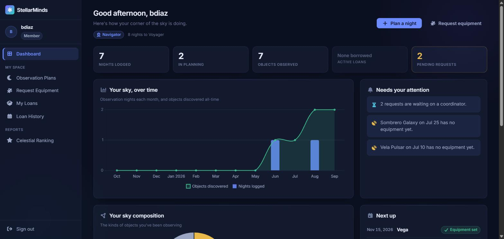
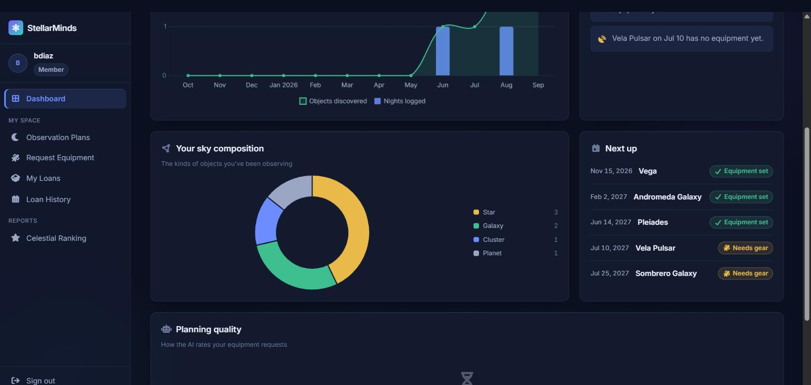
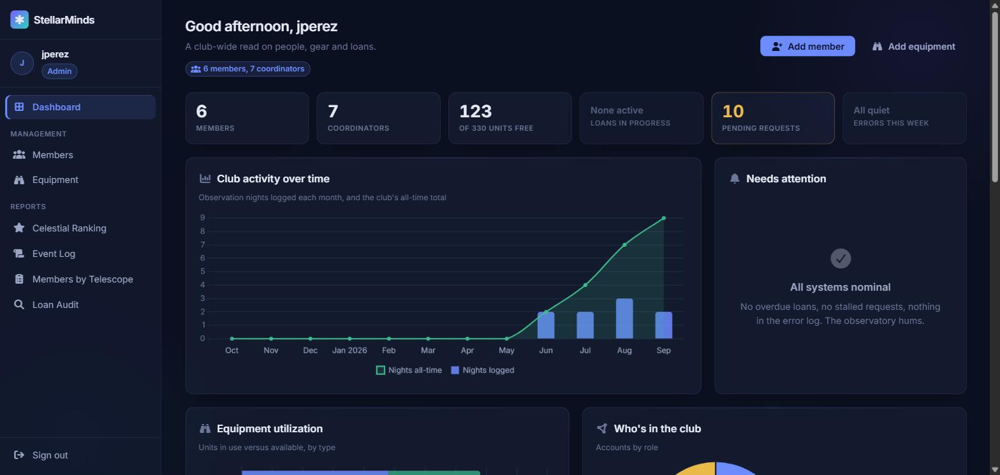
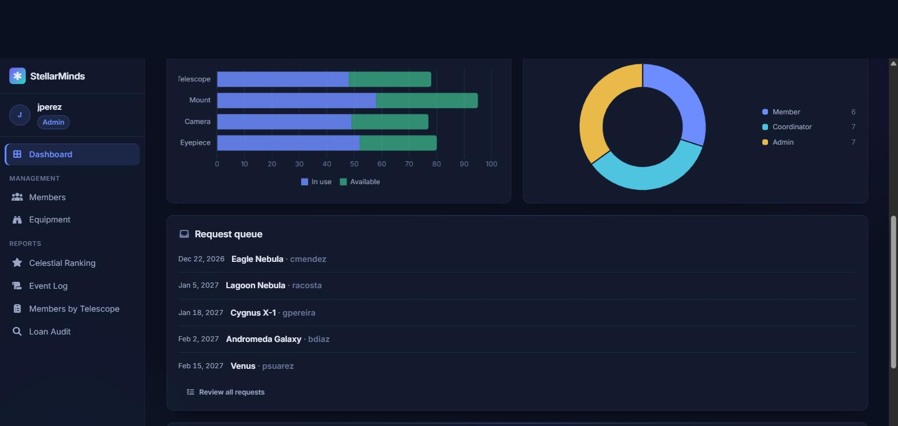
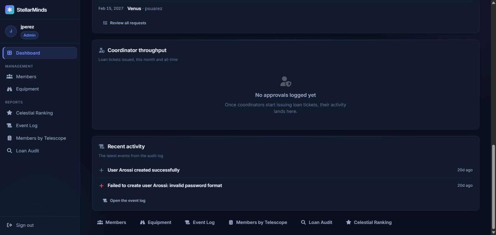
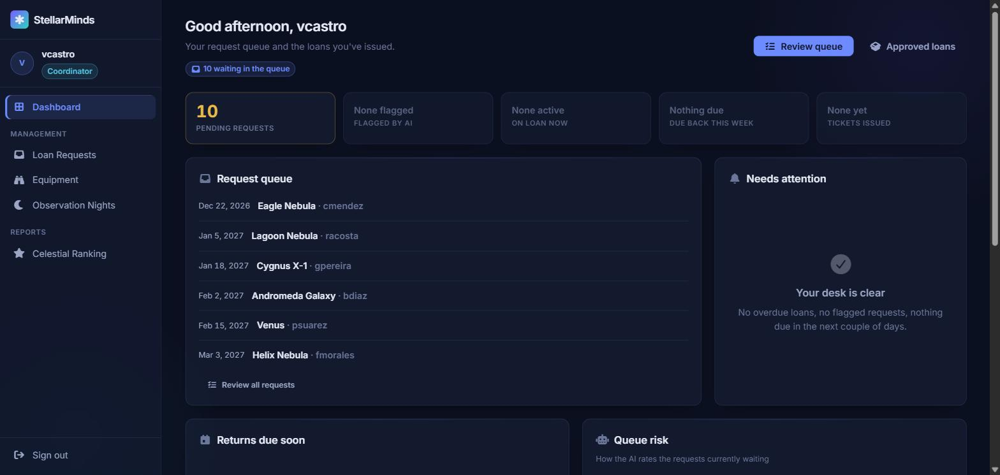
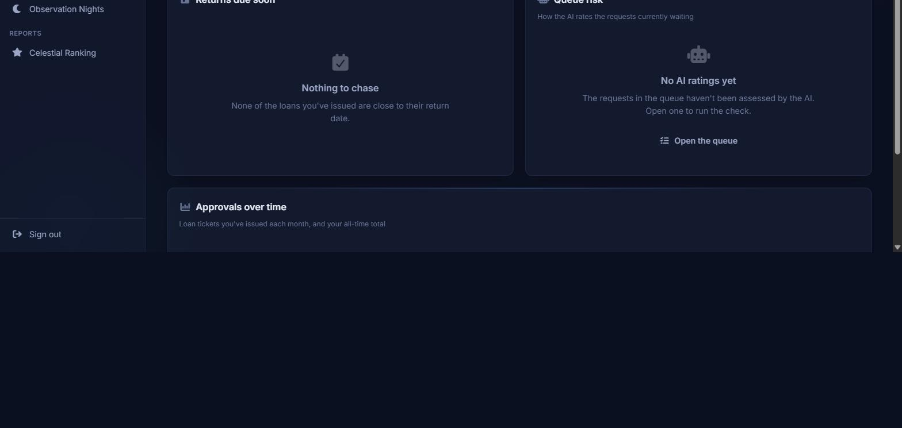

# StellarMinds Dashboards

`Home/Index` renders a role-specific dashboard: `MemberDashboard`,
`AdminDashboard` or `CoordinatorDashboard`. All figures are aggregated
**client-side in `HomeController`** from existing API endpoints — no new server
data. Every fetch is wrapped in its own `try/catch`; a failure sets
`PartialLoad` (amber banner) and that panel falls back to an empty state rather
than breaking the page.

Charts are Chart.js 4.4.1 (jsdelivr CDN), theme-aware — the palette is resolved
at runtime from the `--color-*` design tokens. The 12-month activity chart labels
January with the year (`MMM yyyy` → "Jan 2026") so the year boundary is
unambiguous.

- Companion planning doc: [`member-dashboard-plan.md`](./member-dashboard-plan.md)
- Session log: [`member-dashboard-devlog.md`](./member-dashboard-devlog.md)
- Screenshots: [`screenshots/`](./screenshots/)

Data below was validated against the Render API (`stellarmind-api.onrender.com`)
on **2026-09-02** with the seed accounts `bdiaz` (Member), `jperez` (Admin),
`vcastro` (Coordinator). Every panel's source, field and calculation was checked
against the live response shapes; the rendered numbers in the screenshots match
the API to the digit.

---

## Member dashboard

**Sources** (`userId` = session `UserId`):

| # | Endpoint | Shape |
|---|----------|-------|
| 1 | `GET api/v1/users/nights/{userId}` | `List<ObservationNightVM>` — `id`, `date`, `celestialObject{id,name,type}`, `isRequested` |
| 2 | `GET api/v1/loanrequests/user/{userId}` | `List<PendingLoanRequestVM>` — `status`, `aiIndicator`, `observationNight{id}` |
| 3 | `GET api/v1/loantickets/user/{userId}` | `List<LoanTicketVM>` — `status`, `isOverdue`, `endDate`, `loanRequest{...}` (returns **204** when the member has no tickets → treated as empty, not a `PartialLoad`) |

### KPI strip

| Tile | Source | Calculation | Zero state |
|------|--------|-------------|-----------|
| Nights logged | ① | `nights.Count` | "None yet" |
| In planning | ① | `nights.Count(n => !n.IsRequested)` | "Nothing queued" |
| Objects observed | ① | distinct non-null `celestialObject.id` | "None yet" |
| Active loans | ③ | `tickets.Count(status == "Loaned")` | "None borrowed" |
| Pending requests | ② | `requests.Count(status == "Pending")` — amber when > 0 | "None waiting" |
| Overdue | ③ | `tickets.Count(t => t.isOverdue)` — **only rendered when > 0** | — |

### Panels

| Panel | Source | Calculation |
|-------|--------|-------------|
| **Your sky, over time** (combo chart) | ① | 12 zero-filled month buckets. Bars = nights that month. Line = *distinct objects discovered all-time* up to each month-end (each object counted from its first sighting — monotonic). |
| **Your sky composition** (doughnut + legend) | ① | Nights grouped by `CelestialTypeInfo.Group(celestialObject.type)` (Star / Cluster / Nebula / Galaxy / Planet / Small Body / Quasar / Other), ordered by count desc. Colours from `CelestialTypeInfo.GroupColorVar`. |
| **Needs your attention** | ①②③ | Overdue tickets (danger) · a "N requests waiting on a coordinator" line when `PendingRequests > 0` (info) · each **future** night with `isRequested == false` → "… has no equipment yet" (warning). Capped at 6. |
| **Next up** | ①② | Nights with `date >= today`, soonest first, take 5. "Equipment set" when `isRequested` **or** a Pending/Approved request exists for that night; otherwise "Needs gear". |
| **Planning quality** | ② | Requests grouped by `aiIndicator` (IDEAL / ADECUADO / NO_RECOMENDABLE). Shown only when the AI has rated something; else "No assessments yet" (has requests) or "Nothing to assess yet" (none). |
| **Stargazer level** (page-head chip) | ① | `NightsLogged` → Cadet (0) / Observer (1–4) / Navigator (5–14) / Voyager (15–29) / Cosmonaut (30+), with "N nights to \<next tier\>". |

**Validated (`bdiaz`, userId 15):** 7 nights → *7 nights logged*, *2 in planning*
(2 not-requested), *7 objects observed* (7 distinct ids). Sky composition:
types `{1,1,19}`→Star = 3, `{11,11}`→Galaxy = 2, `{5}`→Cluster = 1,
`{13}`→Planet = 1 — matches the doughnut legend exactly. 5 requests
(2 Approved / 2 Pending / 1 Rejected), all `aiIndicator = null` → *2 pending*,
Planning quality = "No assessments yet". No tickets (204) → *None borrowed*, no
Overdue tile. Stargazer = Navigator, "8 nights to Voyager" (`15 − 7`). Next up:
Vega / Andromeda / Pleiades ("Equipment set") + Vela Pulsar / Sombrero Galaxy
("Needs gear"). Needs attention: the pending-count line + the two un-geared
future nights.

---

## Admin dashboard

**Sources** (all club-wide; each `try/catch` → `PartialLoad`):

| # | Endpoint | Shape |
|---|----------|-------|
| 1 | `GET api/v1/users` | `List<UserVM>` — `role` |
| 2 | `GET api/v1/equipment` | `List<EquipmentVM>` — `type`, `quantity`, `availableQuantity` |
| 3 | `GET api/v1/loantickets` | `List<LoanTicketVM>` — `status`, `isOverdue`, `startDate`, `coordinatorName` (**204** on empty seed → empty list) |
| 4 | `GET api/v1/loanrequests/pending` | `List<PendingLoanRequestVM>` — `aiIndicator`, `observationNight{date,celestialObject}`, `requestingUser{username}` |
| 5 | `GET api/v1/observationnights` | `List<ObservationNightVM>` — `date` |
| 6 | `GET api/v1/logs` | `List<LogEventDto>` — `operation`, `tableName`, `email`, `message`, `isError`, `date` (Admin/Coordinator only) |

### KPI strip

| Tile | Source | Calculation | Notes |
|------|--------|-------------|-------|
| Members | ① | `users.Count(role == "Member")` | |
| Coordinators | ① | `users.Count(role == "Coordinator")` | |
| … of N units free | ② | `Σ availableQuantity` of `Σ quantity` | label shows the total |
| Loans in progress | ③ | `tickets.Count(status == "Loaned")` | "None active" at 0 |
| Pending requests | ④ | `pending.Count` — amber when > 0 | |
| Errors this week | ⑥ | `logs.Count(l => l.isError && date >= today−7d)` | "All quiet" at 0 |
| Overdue | ③ | `tickets.Count(isOverdue)` — **only when > 0** | |

### Panels

| Panel | Source | Calculation |
|-------|--------|-------------|
| **Club activity over time** (combo) | ⑤ | 12 zero-filled buckets. Bars = observation nights logged that month. Line = cumulative night count all-time to each month-end. |
| **Equipment utilization** (stacked h-bar) | ② | Per type (Telescope / Mount / Camera / Eyepiece): "In use" = `Σ quantity − Σ availableQuantity`, "Available" = `Σ availableQuantity`. |
| **Who's in the club** (doughnut + legend) | ① | Counts for Member / Coordinator / Admin (accent / info / warning), zero slices dropped. |
| **Needs attention** | ②③④⑥ | Overdue tickets (danger) · pending whose night is within 2 days *and not in the past* (warning) · each equipment type with `Σ availableQuantity == 0` (warning) · up to 2 log errors from the last 7 days (danger). Capped at 6. |
| **Request queue** | ④ | `pending` ordered by target-night date, take 5: date · object · requester, plus an AI chip when rated. |
| **Queue risk** (compact AI strip) | ④ | `pending` grouped by `aiIndicator`. Rendered only when the AI has rated something. |
| **Coordinator throughput** (table) | ③ | Tickets grouped by `coordinatorName`: issued this month (`startDate` in current month) and all-time, with a proportional bar. Empty → "No approvals logged yet". |
| **Recent activity** | ⑥ | Audit log **filtered to writes + errors** (`isError` or operation ∈ CREATE/UPDATE/DELETE/POST/PUT/PATCH) — successful reads are dropped so the digest carries signal. Newest first, take 6. Icon by operation; error rows tinted danger. |

**Validated (`jperez`):** 20 users → 6 Member / 7 Coordinator / 7 Admin
(club-size chip, role doughnut). 41 equipment rows → 330 total units, 123
available → *"123 of 330 units free"*; utilization Telescope 48/30, Mount 58/37,
Camera 49/28, Eyepiece 52/28. `loantickets` = 204 → *Loans in progress: None
active*, no Overdue tile, Coordinator throughput empty. 10 pending requests, all
`aiIndicator = null` → *10 pending*, Queue-risk strip hidden, queue lists the 5
soonest (Eagle Nebula 22 Dec 2026 … Venus 15 Feb 2027). 29 observation nights,
earliest June 2026 → activity bars Jun 2 / Jul 2 / Aug 3 / Sep 2, cumulative line
to 9. 13 log rows (11 GET + 2 POST, 1 error, all ~20 days old) → *Errors this
week: All quiet*; Needs attention empty ("All systems nominal"); Recent activity
= just the two POST rows ("User Arossi created successfully" + "Failed to create
user Arossi: invalid password format"), the 9 read rows filtered out.

---

## Coordinator dashboard

Layout leads with the **Request queue** — the coordinator's actual job — then
Needs attention, then Returns due / Queue risk, with the history chart at the
foot.

**Sources** (`coordinatorId` = session `UserId`):

| # | Endpoint | Shape |
|---|----------|-------|
| 1 | `GET api/v1/loanrequests/pending` | `List<PendingLoanRequestVM>` — the shared queue |
| 2 | `GET api/v1/loantickets` | `List<LoanTicketVM>`, filtered client-side to `coordinatorId == me`. The scoped route `loantickets/coordinator/{id}` is **Admin-only** (403 for the coordinator themselves); the full list is Coordinator-readable and returns **204** on the empty seed. |

### KPI strip

| Tile | Source | Calculation | Zero state |
|------|--------|-------------|-----------|
| Pending requests | ① | `pending.Count` — amber when > 0 | "Queue clear" |
| Flagged by AI | ① | `pending.Count(aiIndicator == "NO_RECOMENDABLE")` — danger when > 0 | "None flagged" |
| On loan now | ② | `mine.Count(status == "Loaned")` | "None active" |
| Due back this week | ② | `mine.Count(Loaned && endDate in [today, today+7d])` — amber when > 0 | "Nothing due" |
| Tickets issued | ② | `mine.Count` | "None yet" |
| Overdue | ② | `mine.Count(isOverdue)` — **only when > 0** | — |

### Panels

| Panel | Source | Calculation |
|-------|--------|-------------|
| **Request queue** | ① | `pending` ordered by target-night date, take 6: date · object · requester, AI chip when rated. |
| **Needs attention** | ①② | My overdue tickets (danger) · an AI-flag summary line when `FlaggedByAi > 0` (warning) · pending whose night is 0–3 days out (warning) · my loans due back in 0–2 days (info). Capped at 6. |
| **Returns due soon** | ② | My `Loaned` tickets ordered by `endDate`, take 5: due date · object · member, "Overdue" chip when applicable. |
| **Queue risk** (doughnut + legend) | ① | `pending` grouped by `aiIndicator` (+ an "Unrated" slice when any are unrated). Rendered only when at least one request is *actually rated*; an all-unrated queue shows "No AI ratings yet" instead of a flat grey ring. |
| **Approvals over time** (combo) | ② | 12 zero-filled buckets. Bars = tickets I issued that month (`startDate`). Line = cumulative issued all-time to each month-end. |
| Queue-note chip (page head) | ① | "Queue clear" / "N waiting in the queue". |

**Validated (`vcastro`, userId 8):** 10 pending requests, all
`aiIndicator = null` → *10 pending* (amber), *None flagged*, chip "10 waiting in
the queue", queue lists the 6 soonest (Eagle Nebula … Helix Nebula 3 Mar 2027),
Queue risk = "No AI ratings yet". `loantickets` = 204 → no tickets belong to
this coordinator → *None active / Nothing due / None yet*, no Overdue tile,
Returns due soon = "Nothing to chase", Approvals over time = "No approvals yet".
Needs attention empty ("Your desk is clear") — no overdue, nothing AI-flagged, no
pending night within 3 days (earliest is 22 Dec 2026).

---

## Notes / limitations on the current seed

- No loan tickets exist in the seed, so every ticket-derived panel
  (Coordinator throughput, Returns due soon, Approvals-over-time chart, "on
  loan" / "overdue" / "due this week" KPIs) renders its empty state. The
  populated paths are exercised in code but not yet visually, pending an account
  with loan history.
- Pending requests carry no `aiIndicator` in the seed, so the AI-risk
  visualisations (Admin "Queue risk" strip, Coordinator "Queue risk" doughnut,
  Member "Planning quality") show their "nothing rated yet" states.
- `HomeController` VMs expose `HasNights` / `HasTickets` flags that the current
  views don't read (leftover from the empty-state pass) — harmless, no data
  impact.
